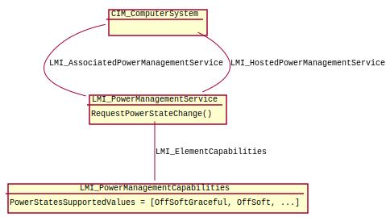

.. _concepts:

Power Management API concepts
=============================

    Class diagram for Power Management provider.

Base class of this provider is
:ref:`LMI_PowerManagementService <LMI-PowerManagementService>`.
This class has method
:ref:`RequestPowerStateChange <LMI-PowerManagementService-RequestPowerStateChange>`
that can be used for changing between power states.

For list of available power states, see property
:ref:`PowerStatesSupported <LMI-PowerManagementCapabilities-PowerStatesSupported>`
of the class
:ref:`LMI_PowerManagementCapabilities <LMI-PowerManagementCapabilities>`
