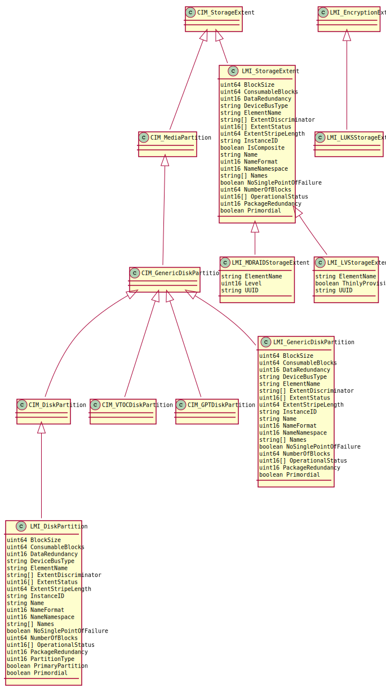

Device hierarchy
================

The API manages all block devices in machine's local /dev/ directory, i.e. also
remote disks (iSCSI, FcoE, ...), as long as there is appropriate device in
local /dev/.

Each block device is represented by instance of
:ref:`CIM_StorageExtent<CIM-StorageExtent>` or its subclasss.

:ref:`LMI_StorageExtent<LMI-storageextent>` represents all devices, which do not
have any specific :ref:`CIM_StorageExtent<CIM-StorageExtent>` subclass.

Each volume group is represented by :ref:`LMI_VGStoragePool<LMI-VGStoragePool>`.

.. figure:: generated/pool-inherit.svg

Instances of :ref:`LMI_VGStoragePool<LMI-VGStoragePool>`,
:ref:`CIM_StorageExtent<CIM-StorageExtent>` and its subclasses
compose an oriented graph of devices on the system. Devices are connected with
these associations or their subclasses:

- :ref:`CIM_BasedOn<CIM-BasedOn>` and is subclasses associates a block device to
  all devices, on which it directly depends on, for example a partition is
  associated to a disk, on which it resides, and MD RAID is associated to all
  underlying devices, which compose the RAID.

- :ref:`LMI_VGAssociatedComponentExtent<LMI-VGAssociatedComponentExtent>`
  associates volume groups with its physical extents.

- :ref:`LMI_LVAllocatedFromStoragePool<LMI-LVAllocatedFromStoragePool>`
  associates logical volumes to their volume groups.

.. figure:: pic/raid-lvm-simple.svg

  Example of two logical volumes allocated from volume group created on top of
  MD RAID with three devices.

